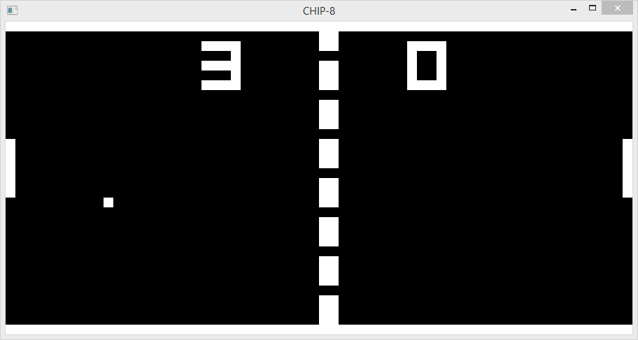

[CHIP-8](https://en.wikipedia.org/wiki/CHIP-8) emulator for Windows written in C++.

Usage: `chip8 path/to/program`

CHIP-8 supports 16 keys that are mapped to these keys in the emulator:

1|2|3|4
Q|W|E|R
A|S|D|F
Z|X|C|V

`ESC` is exit.
